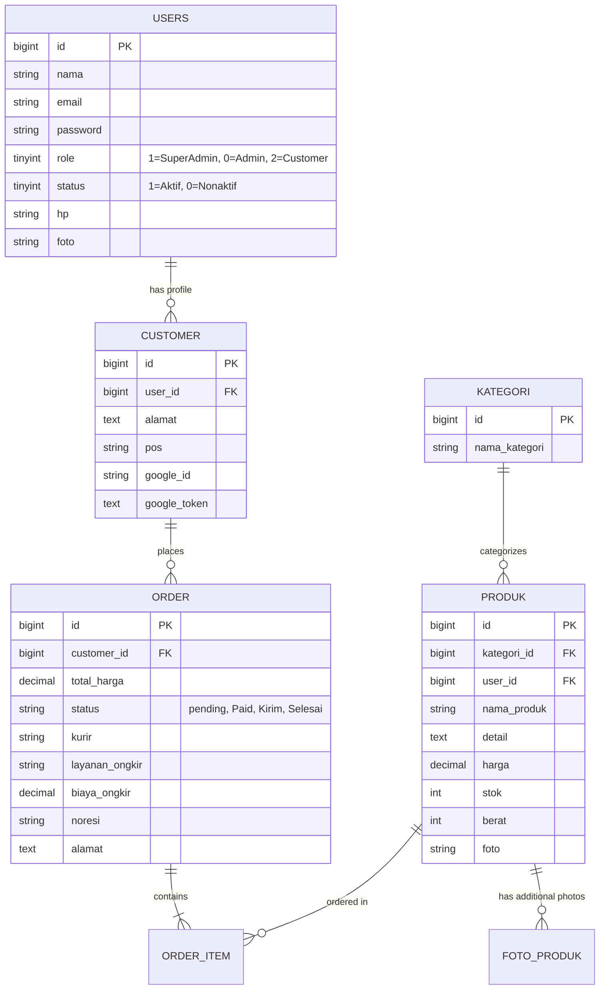

<div align="center">

# 🍃 Toko Online Makanan Nusantara
### *Platform E-Commerce Kuliner & Jajanan Khas Tradisional Indonesia*

[](https://laravel.com)
[](https://php.net)
[](https://mysql.com)
[](https://midtrans.com)
[](https://rajaongkir.komerce.id)
[](https://cloud.google.com)

<br>

<p align="center">
  <strong>Toko Online Makanan Nusantara</strong> adalah aplikasi web e-commerce modern yang dirancang untuk mempermudah pemesanan kuliner dan jajanan khas daerah di seluruh Indonesia secara online. Dilengkapi dengan antarmuka bertema segar (Fresh Forest Emerald & Warm Amber), kalkulasi ongkos kirim real-time ekspedisi nasional, pembayaran otomatis multi-channel, dan panel dashboard administrator yang komprehensif.
</p>

[Fitur Utama](#-fitur-utama) •
[Tech Stack](#-teknologi-yang-digunakan) •
[Struktur Database](#-struktur-database) •
[Instalasi](#-panduan-instalasi--setup) •
[Konfigurasi API](#-konfigurasi-api-third-party) •
[Akun Default](#-akun-pengujian-default)

</div>

---

## 🌟 Fitur Utama

### 🛍️ 1. Storefront & Katalog Produk Interaktif
* **Desain UI/UX Modern**: Tipografi bersih menggunakan Google Font *Plus Jakarta Sans* dengan palet warna kuliner yang menggugah selera.
* **Filter Kategori Cerdas**: Navigasi katalog dinamis berdasarkan kategori makanan (Kue Basah, Cemilan Tradisional, Frozen Food, dll).
* **Galeri Thumbnail Produk Multi-Size**: Mendukung galeri foto dengan thumbnail otomatis (*Large, Medium, Small*) untuk performa loading maksimal.
* **Detail Spesifikasi Lengkap**: Menampilkan informasi berat produk (gram), stok tersedia, dan deskripsi detail.

### 🛒 2. Alur Checkout Multi-Step yang Rapi
* **Step Progress Tracker**: Indikator tahapan visual (`1. Keranjang Belanja` &rarr; `2. Pilih Pengiriman` &rarr; `3. Pembayaran`).
* **Keranjang Belanja Real-Time**: Update kuantiti pesanan, hapus item, dan ringkasan subtotal harga otomatis.
* **Layout Full-Width**: Area checkout didesain lega dan nyaman tanpa terhimpit sidebar.

### 🚚 3. Cek Ongkir Otomatis (RajaOngkir / Komerce API)
* **Kalkulasi Tarif Real-Time**: Terintegrasi langsung dengan API Komerce RajaOngkir untuk ekspedisi **JNE, TIKI, dan POS Indonesia**.
* **Dropdown Wilayah Dinamis**: Pilihan provinsi dan kota/kabupaten tujuan terisi otomatis via AJAX Fetch.
* **Estimasi Hari Pengiriman**: Menampilkan rincian paket layanan (REG, OKE, YES, CTC, JTR) beserta estimasi waktu sampai.

### 💳 4. Pembayaran Otomatis (Midtrans Payment Gateway)
* **Midtrans Snap Popup**: Modal pembayaran instan tanpa perlu meninggalkan halaman website.
* **Metode Pembayaran Lengkap**:
  * **QRIS** (GoPay, ShopeePay, OVO, Dana, LinkAja)
  * **Virtual Account Bank** (BCA, BNI, BRI, Mandiri, Permata)
  * **Convenience Store** (Indomaret, Alfamart)
  * **Kartu Kredit / Debit Online**
* **Auto Update Status**: Status pesanan otomatis berubah menjadi `Diproses (Paid)` setelah pembayaran berhasil diselesaikan.

### 🔐 5. Google OAuth Single Sign-On (SSO)
* **Login & Registrasi 1-Klik**: Pelanggan dapat masuk secara instan menggunakan akun Google mereka melalui Laravel Socialite.
* **Auto-Profile Sync**: Profil pelanggan dan riwayat transaksi otomatis tersinkronisasi dengan akun Google.

### 📊 6. Dashboard & Panel Administrator
* **4 Stat Metric Cards**: Pantau jumlah Total Produk, Kategori, Pelanggan, dan Pesanan Masuk secara *real-time*.
* **Tabel Transaksi Terbaru**: Menampilkan status pesanan langsung dari database.
* **Manajemen Alur Status Pesanan**: Update status transaksi dari `Diproses` &rarr; `Dikirim` (Input No. Resi) &rarr; `Selesai`.
* **Kalkulasi Omset Selesai**: Menghitung akumulasi total pendapatan kotor dari transaksi yang telah tuntas.
* **Cetak Laporan & Invoice**:
  * Cetak Invoice resmi pesanan per ID transaksi.
  * Cetak Rekap Laporan Penjualan (User, Produk, Pesanan Diproses, dan Pesanan Selesai) berdasarkan rentang tanggal.

---

## 🛠️ Teknologi yang Digunakan

| Komponen | Teknologi / Library |
| :--- | :--- |
| **Framework Backend** | [Laravel 10.x](https://laravel.com/) |
| **Bahasa Pemrograman** | PHP 8.1 / 8.2 |
| **Database** | MySQL (MariaDB) |
| **Frontend Styling** | Custom Vanilla CSS Design System (`modern-custom.css`), Bootstrap 4, FontAwesome |
| **Tipografi** | [Plus Jakarta Sans (Google Fonts)](https://fonts.google.com/specimen/Plus+Jakarta+Sans) |
| **Payment Gateway** | [Midtrans Snap SDK](https://midtrans.com) |
| **Shipping Logistics** | [Komerce RajaOngkir API](https://rajaongkir.komerce.id) |
| **Authentication** | Laravel Socialite (Google OAuth 2.0) & Native Auth |
| **Editor Teks** | CKEditor 5 |

---

## 🗄️ Struktur Database

Aplikasi ini menggunakan skema relasional yang terstruktur rapi:



---

## 🚀 Panduan Instalasi & Setup

Ikuti langkah-langkah berikut untuk menjalankan proyek ini di komputer lokal Anda:

### 1. Clone Repository
```bash
git clone https://github.com/Luthfi-1012/Toko-Online.git
cd Toko-Online
```

### 2. Install Dependencies
```bash
# Install PHP dependencies
composer install

# Install Frontend assets
npm install
```

### 3. Konfigurasi Environment (`.env`)
Salin file template `.env.example` menjadi `.env`:
```bash
cp .env.example .env
```

Buka file `.env` dan sesuaikan koneksi database MySQL Anda:
```env
DB_CONNECTION=mysql
DB_HOST=127.0.0.1
DB_PORT=3306
DB_DATABASE=db_tokoonline
DB_USERNAME=root
DB_PASSWORD=
```

### 4. Generate Application Key & Storage Link
```bash
php artisan key:generate
php artisan storage:link
```

### 5. Jalankan Migrasi & Database Seeder
```bash
php artisan migrate --seed
```

### 6. Jalankan Server Lokal
```bash
php artisan serve
```
Akses aplikasi melalui browser: **`http://127.0.0.1:8000`**

---

## 🔑 Konfigurasi API Third-Party

Tambahkan kunci API berikut ke file `.env` Anda:

```env
# 1. RajaOngkir (Komerce)
RAJAONGKIR_API_KEY=your_komerce_api_key
RAJAONGKIR_BASE_URL=https://rajaongkir.komerce.id/api/v1

# 2. Midtrans Payment Gateway (Sandbox)
MIDTRANS_MERCHANT_ID=your_merchant_id
MIDTRANS_CLIENT_KEY=your_client_key
MIDTRANS_SERVER_KEY=your_server_key
MIDTRANS_IS_PRODUCTION=false
MIDTRANS_IS_SANITIZED=true
MIDTRANS_IS_3DS=true

# 3. Google OAuth Single Sign-On
GOOGLE_CLIENT_ID=your_google_client_id.apps.googleusercontent.com
GOOGLE_CLIENT_SECRET=your_google_client_secret
GOOGLE_REDIRECT_URL=http://127.0.0.1:8000/auth/google/callback
```

---

## 👤 Akun Pengujian Default

Setelah menjalankan `php artisan migrate --seed`, akun berikut siap digunakan:

| Tipe Akun | Email | Password | URL Login |
| :--- | :--- | :--- | :--- |
| **Super Admin** | `admin@gmail.com` | `bsi06` | `/backend/login` |
| **Admin Toko** | `oke@gmail.com` | `bsi06` | `/backend/login` |
| **Staff Admin** | `luthfi@gmail.com` | `farhan123` | `/backend/login` |
| **Customer Demo** | `customer@gmail.com` | `password123` | SSO via Google atau Auth |

---

## 👥 Kontributor & Pengembang

* **Mata Kuliah**: Web Programming III
* **Prodi**: Teknologi Informasi / Sistem Informasi
* **Institusi**: Universitas Bina Sarana Informatika (UBSI)
* **GitHub Repository**: [@Luthfi-1012/Toko-Online](https://github.com/Luthfi-1012/Toko-Online)

---

<div align="center">
  <sub>Dibuat dengan ❤️ untuk melestarikan dan mendigitalkan cita rasa kuliner khas Nusantara.</sub>
</div>
